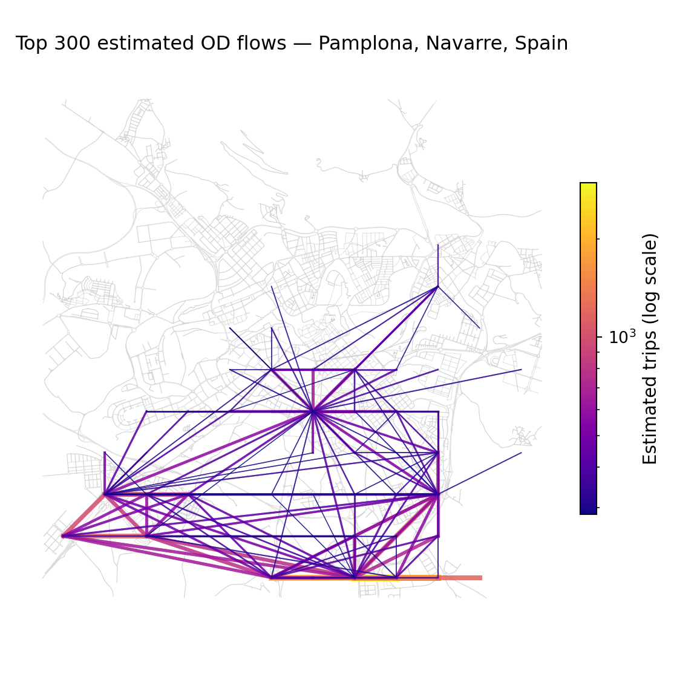
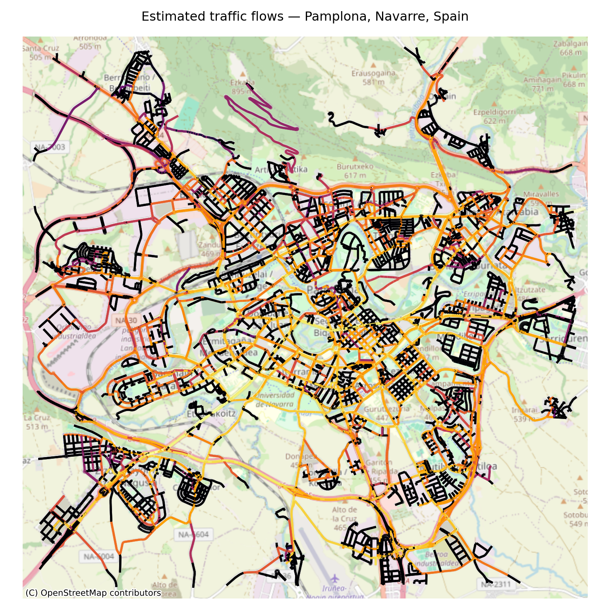

```{python}
#| label: export-pamplona-csv
#| include: false
import os
import pandas as pd
import geopandas as gpd
from shapely.geometry import Point

if not os.path.exists("pamplona_zones.csv") or not os.path.exists("pamplona_real_flows.csv"):
    locs = pd.read_parquet('locations_north.parquet')
    flows = pd.read_parquet('flows_north_time.parquet')
    
    locs_gdf = gpd.GeoDataFrame(
        locs, 
        geometry=gpd.points_from_xy(locs['lon'], locs['lat']), 
        crs="EPSG:4326"
    )
    # Using local UTM zone 30N (EPSG:32630) for Pamplona to calculate distance in meters
    locs_proj = locs_gdf.to_crs(epsg=32630)
    centre_proj = gpd.GeoSeries([Point(-1.6432, 42.8166)], crs="EPSG:4326").to_crs(epsg=32630).iloc[0]
    locs_gdf['dist'] = locs_proj.distance(centre_proj)
    
    p_zones = locs_gdf[locs_gdf['dist'] <= 10000].copy()
    p_zones_df = pd.DataFrame(p_zones.drop(columns='geometry'))
    p_zones_df.to_csv('pamplona_zones.csv', index=False)
    
    p_flows = flows[flows['origin'].isin(p_zones['id']) & flows['dest'].isin(p_zones['id'])].copy()
    p_flows = p_flows.groupby(['origin', 'dest'])['count'].sum().reset_index()
    p_flows.rename(columns={'count': 'daily_volume'}, inplace=True)
    p_flows['daily_volume'] = p_flows['daily_volume'] / 3
    p_flows.to_csv('pamplona_real_flows.csv', index=False)
```

## Setup

We begin by loading the required Python libraries.

```{python}
#| label: setup-packages
import os
import tempfile
import geopandas as gpd
import pandas as pd
import numpy as np
import osmnx as ox
import osm2gmns as og
import grid2demand as gd
from shapely import wkt
import matplotlib.pyplot as plt
import matplotlib.cm as cm
import matplotlib.colors as mcolors
from shapely.geometry import LineString
from collections import defaultdict
from scipy.spatial import cKDTree
import networkx as nx
import contextily as ctx
```

## Choose a City

Select a city to analyze.
We use **Pamplona, Navarre, Spain** by default so we can validate the results against our actual Spanish OD daily dataset.

```{python}
#| label: select-city
# You can change this to other cities (e.g. "Kyiv", "Lviv", "Dnipro", "Donetsk", "Luhansk")
city = "Pamplona, Navarre, Spain"
print("You have selected:", city)
```

## Estimate an Origin-Destination (OD) Matrix

We divide the study area into a 12x12 grid and download the network and points of interest (POIs) from OpenStreetMap.

```{python}
#| label: configuration
# Radius around the city centre to include (metres)
RADIUS_M = 5000

# Number of grid cells in each direction (total zones = X × Y)
NUM_X_BLOCKS = 12
NUM_Y_BLOCKS = 12

# Where to save outputs
OUTPUT_DIR = "./grid2demand_output"
```

### Download road network and POIs

We geocode the city centre coordinates and download the road network and POIs.

```{python}
#| label: download-data
print(f"Locating city centre for: {city}")
city_boundary = ox.geocode_to_gdf(city)
city_boundary_proj = city_boundary.to_crs(city_boundary.estimate_utm_crs())
city_centre_proj = city_boundary_proj.geometry.centroid.iloc[0]
city_centre = (
    gpd.GeoSeries([city_centre_proj], crs=city_boundary_proj.crs)
    .to_crs(city_boundary.crs)
    .iloc[0]
)
latitude  = city_centre.y
longitude = city_centre.x
print(f"City centre found: {latitude:.4f}°N, {longitude:.4f}°E")

print("Downloading road network...")
G = ox.graph_from_point(
    (latitude, longitude),
    dist=RADIUS_M,
    network_type="drive",
    simplify=False
)
print("Road network downloaded.")

print("Downloading points of interest...")
poi_gdf = ox.features_from_point(
    (latitude, longitude),
    tags={"amenity": True, "shop": True, "leisure": True,
          "tourism": True, "building": True, "office": True, "landuse": True},
    dist=RADIUS_M
)
poi_gdf = poi_gdf.reset_index(drop=True)
poi_gdf = poi_gdf[poi_gdf.geometry.notnull()].copy()
print(f"Downloaded {len(poi_gdf):,} POIs.")
```

### Convert network and set up zones

We convert the road network to GMNS format and set up the grid zones.

```{python}
#| label: convert-network
osm_file = "study_area.osm"
print("Exporting network to OSM file...")
ox.save_graph_xml(G, filepath=osm_file)

print("Converting to GMNS format...")
network = og.getNetFromFile(osm_file, POI=False)
gmns_temp_dir = tempfile.mkdtemp()
og.outputNetToCSV(network, output_folder=gmns_temp_dir)
print("GMNS network created.")

# Build and inject POI file
geoms   = poi_gdf.geometry
n       = len(poi_gdf)
poi_df  = pd.DataFrame({
    "poi_id":   np.arange(n),
    "geometry": [g.wkt          for g in geoms],
    "centroid": [g.centroid.wkt for g in geoms],
    "area":     [g.area         for g in geoms],
    "building": poi_gdf["building"].fillna("").astype(str) if "building" in poi_gdf.columns else "",
    "amenity":  poi_gdf["amenity"].fillna("").astype(str)  if "amenity"  in poi_gdf.columns else "",
})[["poi_id", "building", "amenity", "centroid", "area", "geometry"]]

poi_df.to_csv(os.path.join(gmns_temp_dir, "poi.csv"), index=False)
print(f"POI file written ({n:,} features).")

print("Loading grid2demand...")
g2d = gd.GRID2DEMAND(input_dir=gmns_temp_dir, verbose=True)

if not hasattr(g2d, "map_mapping_between_zone_and_node_poi"):
    g2d.map_mapping_between_zone_and_node_poi = g2d.map_zone_node_poi

g2d.load_network()
g2d.net2grid(num_x_blocks=NUM_X_BLOCKS, num_y_blocks=NUM_Y_BLOCKS)
g2d.taz2zone()
print("Zones created.")
```

### Run the gravity model and save results

We estimate trip volumes using the gravity model.

```{python}
#| label: gravity-model
print("Running gravity model...")
g2d.map_zone_node_poi()
g2d.calc_zone_od_distance()
demand_df = g2d.run_gravity_model()
print("Gravity model complete.")

os.makedirs(OUTPUT_DIR, exist_ok=True)
g2d.save_results_to_csv(
    output_dir=OUTPUT_DIR,
    demand=True, zone=True, node=True, poi=True,
    demand_od_matrix=True, overwrite_file=True
)
print(f"Results saved to: {OUTPUT_DIR}")

demand_matrix = pd.read_csv(os.path.join(OUTPUT_DIR, "demand.csv"))
print(f"\nOD matrix shape: {demand_matrix.shape[0]:,} rows × {demand_matrix.shape[1]} columns")
```

## Visualise the OD Matrix

We construct desire lines to show travel demand patterns.

```{python}
#| label: visualize-desire-lines
TOP_N_FLOWS = 300

# Load zone geometry
zone_gdf = gpd.read_file(os.path.join(OUTPUT_DIR, "zone.csv"))
zone_gdf["centroid_lon"] = zone_gdf["centroid"].apply(lambda x: wkt.loads(x).x)
zone_gdf["centroid_lat"] = zone_gdf["centroid"].apply(lambda x: wkt.loads(x).y)

zone_centroids = zone_gdf.set_index("zone_id")[["centroid_lon", "centroid_lat"]]
zone_centroids.index = zone_centroids.index.astype(int)

top_flows = (
    demand_matrix[demand_matrix["volume"] > 0]
    .sort_values("volume", ascending=False)
    .head(TOP_N_FLOWS)
    .copy()
)

top_flows["o_zone_id"] = top_flows["o_zone_id"].astype(int)
top_flows["d_zone_id"] = top_flows["d_zone_id"].astype(int)
lines = []
for _, row in top_flows.iterrows():
    try:
        o = zone_centroids.loc[row["o_zone_id"]]
        d = zone_centroids.loc[row["d_zone_id"]]
        lines.append(LineString([(o["centroid_lon"], o["centroid_lat"]),
                                 (d["centroid_lon"], d["centroid_lat"])]))
    except KeyError:
        lines.append(None)

top_flows["geometry"] = lines
desire_lines = gpd.GeoDataFrame(
    top_flows.dropna(subset=["geometry"]),
    geometry="geometry",
    crs="EPSG:4326"
)

edges = ox.graph_to_gdfs(G, nodes=False, edges=True)
vmin = desire_lines["volume"].min()
vmax = desire_lines["volume"].max()
norm = mcolors.LogNorm(vmin=vmin, vmax=vmax)
cmap = cm.plasma
fig, ax = plt.subplots(figsize=(6, 6))
edges.plot(ax=ax, color="#cccccc", linewidth=0.4, alpha=0.6)

for _, row in desire_lines.iterrows():
    weight = norm(row["volume"])
    ax.plot(
        *row["geometry"].xy,
        color=cmap(weight),
        linewidth=0.5 + weight * 4,
        alpha=0.65
    )

sm = cm.ScalarMappable(cmap=cmap, norm=norm)
sm.set_array([])
cbar = fig.colorbar(sm, ax=ax, shrink=0.5, pad=0.02)
cbar.set_label("Estimated trips (log scale)", fontsize=11)

ax.set_title(f"Top {TOP_N_FLOWS} estimated OD flows — {city}", fontsize=12, pad=15)
ax.set_axis_off()
plt.tight_layout()
plt.show()
```



## Assign Traffic Flows to the Network

### Project network and map zones to nodes

```{python}
#| label: project-network
print("Projecting graph...")
G = ox.project_graph(G)
graph_crs = G.graph["crs"]

node_ids    = np.array(list(G.nodes()))
node_coords = np.array([(G.nodes[n]["x"], G.nodes[n]["y"]) for n in node_ids])
tree        = cKDTree(node_coords)

def nearest_node(coord):
    _, idx = tree.query(coord)
    return node_ids[idx]

print("Snapping zone centroids to network nodes...")
zone_node_map = {}
for zone_id, z in g2d.zone_dict.items():
    geom = wkt.loads(z["centroid"])
    geom_proj = (
        gpd.GeoSeries([geom], crs="EPSG:4326")
        .to_crs(graph_crs)
        .iloc[0]
    )
    zone_node_map[zone_id] = nearest_node((geom_proj.x, geom_proj.y))

demand_df = demand_df.copy()
demand_df = demand_df[demand_df["volume"] > 0].copy()

demand_df["o_node"] = demand_df["o_zone_id"].map(zone_node_map)
demand_df["d_node"] = demand_df["d_zone_id"].map(zone_node_map)
demand_df = demand_df.dropna(subset=["o_node", "d_node"])
demand_df["o_node"] = demand_df["o_node"].astype(int)
demand_df["d_node"] = demand_df["d_node"].astype(int)
```

### Scale OD matrix to Pamplona population

Pamplona has a population of approximately 200,000.
We assume 2.1 trips per resident per day.

```{python}
#| label: scale-od
total_population = 200000 
TRIPS_PER_PERSON_PER_DAY = 2.1
target_trips = total_population * TRIPS_PER_PERSON_PER_DAY
raw_total = demand_df["volume"].sum()
scale_factor = target_trips / raw_total
demand_df["volume"] = demand_df["volume"] * scale_factor

print(f"Normalised total daily trips: {demand_df['volume'].sum():,.0f}")
```

### Route trips across the network

```{python}
#| label: route-trips
edge_flow  = defaultdict(float)
od_groups  = demand_df.groupby("o_node")
n_origins  = len(od_groups)

print(f"Routing {n_origins} origin nodes...")
for i, (o_node, group) in enumerate(od_groups):
    _, paths = nx.single_source_dijkstra(G, o_node, weight="length")
    for _, row in group.iterrows():
        d_node = row["d_node"]
        volume = row["volume"]
        if d_node not in paths:
            continue
        path = paths[d_node]
        for u, v in zip(path[:-1], path[1:]):
            if not G.has_edge(u, v):
                continue
            data = G[u][v]
            k    = min(data, key=lambda kk: data[kk].get("length", 1))
            edge_flow[(u, v, k)] += volume

# Write flows back to graph edges
for u, v, k in G.edges(keys=True):
    G[u][v][k]["flow"] = float(edge_flow.get((u, v, k), 0))
```

### Visualise traffic flows on street network

```{python}
#| label: map-flows
flows_raw = np.array([
    data.get("flow", 0)
    for _, _, _, data in G.edges(keys=True, data=True)
])
flows_log = np.log1p(flows_raw)
max_log = flows_log.max() if flows_log.max() > 0 else 1
norm_flows = flows_log / max_log

cmap        = plt.cm.inferno
edge_colors = [cmap(f) for f in norm_flows]

fig, ax = ox.plot_graph(
    G,
    edge_color=edge_colors,
    edge_linewidth=2,
    node_size=0,
    bgcolor="white",
    show=False,
    close=False
)
ax.set_title(f"Estimated traffic flows — {city}", fontsize=12, pad=15)
ctx.add_basemap(
    ax,
    crs=G.graph["crs"],
    source=ctx.providers.OpenStreetMap.Mapnik,
    alpha = 0.8
)
plt.tight_layout()
plt.show()
```



## Validation against Real Daily Flows

Now, we perform the validation.
We load the real daily flows and zone centroids extracted for Pamplona, map the centroids to our 12x12 grid2demand zones using a spatial join, aggregate the flows, and compute the correlation.

**Exercise: what is the correlation between observed flows and the modelled flows using the approach outlined above?**

**How could it be improved?**

```{python}
#| label: validation
# 1. Load Pamplona real zones
p_zones_df = pd.read_csv("pamplona_zones.csv")
p_zones_gdf = gpd.GeoDataFrame(
    p_zones_df,
    geometry=gpd.points_from_xy(p_zones_df["lon"], p_zones_df["lat"]),
    crs="EPSG:4326"
)

# 2. Load grid2demand zones
g2d_zones = pd.read_csv(os.path.join(OUTPUT_DIR, "zone.csv"))
g2d_zones["geometry"] = g2d_zones["geometry"].apply(wkt.loads)
g2d_zones_gdf = gpd.GeoDataFrame(g2d_zones, geometry="geometry", crs="EPSG:4326")

# 3. Spatial join: Map Pamplona zones to grid2demand zones
joined = gpd.sjoin(p_zones_gdf, g2d_zones_gdf, how="inner", predicate="within")
zone_map = dict(zip(joined["id"].astype(str), joined["zone_id"].astype(int)))

# 4. Load Pamplona real flows and map to grid2demand zones
p_flows = pd.read_csv("pamplona_real_flows.csv")
p_flows["o_g2d"] = p_flows["origin"].astype(str).map(zone_map)
p_flows["d_g2d"] = p_flows["dest"].astype(str).map(zone_map)
p_flows = p_flows.dropna(subset=["o_g2d", "d_g2d"])
p_flows["o_g2d"] = p_flows["o_g2d"].astype(int)
p_flows["d_g2d"] = p_flows["d_g2d"].astype(int)

# 5. Aggregate real flows to grid cells
real_grid_flows = p_flows.groupby(["o_g2d", "d_g2d"])["daily_volume"].sum().reset_index()

# 6. Merge real flows with grid2demand gravity model outputs
demand_matrix = pd.read_csv(os.path.join(OUTPUT_DIR, "demand.csv"))
merged = pd.merge(
    real_grid_flows, 
    demand_matrix, 
    left_on=["o_g2d", "d_g2d"], 
    right_on=["o_zone_id", "d_zone_id"], 
    how="inner"
)

# 7. Calculate correlation
corr_pearson = merged["daily_volume"].corr(merged["volume"], method="pearson")
corr_spearman = merged["daily_volume"].corr(merged["volume"], method="spearman")

print("=" * 45)
print("      GRAVITY MODEL VALIDATION RESULTS")
print("=" * 45)
print(f"  {'Matched zone pairs:':<28} {len(merged):>6,}")
print(f"  {'Pearson correlation:':<28} {corr_pearson:>6.4f}")
print(f"  {'Spearman rank correlation:':<28} {corr_spearman:>6.4f}")
print("=" * 45)
```