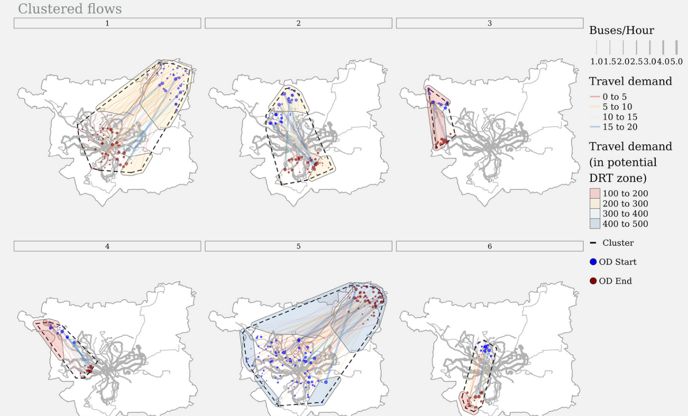
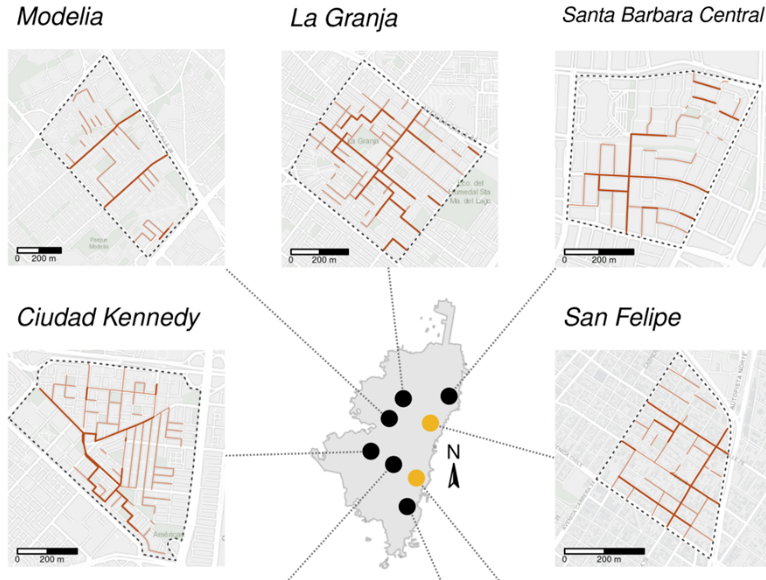

## Delivery Team

-   **Robin Lovelace**\
    *Associate Professor of Transport Data Science, University of Leeds*
-   **Juan Fonseca**\
    *PhD Candidate, University of Leeds*

## Agenda

::::: columns
::: {.column width="50%"}
### Day 1: Sunday, June 7

-   **14:00–18:00** – Practical Workshop Session 1 (with coffee break)
    -   Finding and importing data with {spanishoddata} @kotov2026
    -   Origin-destination analysis
    -   Group work
:::

::: {.column width="50%"}
### Day 2: Monday, June 8

-   **09:00–12:30** – Practical Workshop Session 2
    -   Routing and route networks
    -   Advanced topics
-   **12:30–13:30** – Lunch & Workshop Wrap-up
:::
:::::

------------------------------------------------------------------------

## What research questions and policy needs can be addressed with origin-destination and route network datasets?

-   Unanswered questions in transport research
-   Policy needs in transport planning and management, e.g. [@mahfouz2025]
-   Specific policies and roles, e.g. transport planning officer in local government

## Example of OD-level analysis

Results of clustering OD pairs to identify potential DRT operation sites [@mahfouz2025]

## Example of network-level analysis

Potential cut-through routes identified by examining differences in centrality during rush-hours.
Credit: Juan Fonseca.

------------------------------------------------------------------------

## Research question ideas

-   What factors contribute to greater and lesser mobility connections between places (including and in addition to national borders and The Pyrenees, outlined in the workbook)?
-   To what extent does the transport network reflect flows between places? (And is there any evidence that the transport network is more a cause or a consequence of flows?)
-   Can transport system features such as high-speed rail in Spain be detected in the OD data?

------------------------------------------------------------------------

## Specific questions related to the workbooks

-   What are the main predictors of zonal flows and how can they be modelled?
    -   See the 'jittering' method and implementation in Rust as an example [@lovelace2022]
-   How does the deterrence effect of the Spain-France border vary between weekdays and weekends?
-   To what extent does road segment betweenness centrality predict the assigned traffic volumes from the routing model?

------------------------------------------------------------------------

## Technical/methodological ideas

-   How can estimates of OD flows, e.g. those using the approaches in the Python workbook, be improved? Suggestion: try the {simodels} package in R.
-   How can we better visualise OD flows and route networks? Try the package {od} in R for example.
-   To what extent can the methods presented for Spain be applied to other contexts (you could find other OD or route network datasets, or use the methods to estimate OD flows in other contexts)?
-   What other packages can be used to work with OD and route network datasets, and how do they compare to those used in the workbook?

------------------------------------------------------------------------

## Group work

You will present your work in groups, there are no rules on who does what, but everyone should input.

See placeholder presentations in the workshop website.

------------------------------------------------------------------------

## Key Links

-   **GitHub Repository**: [github.com/tdscience/tartu26](https://github.com/tdscience/tartu26)
-   **Workshop Website**: [tdscience.github.io/tartu26](https://tdscience.github.io/tartu26/)

# References