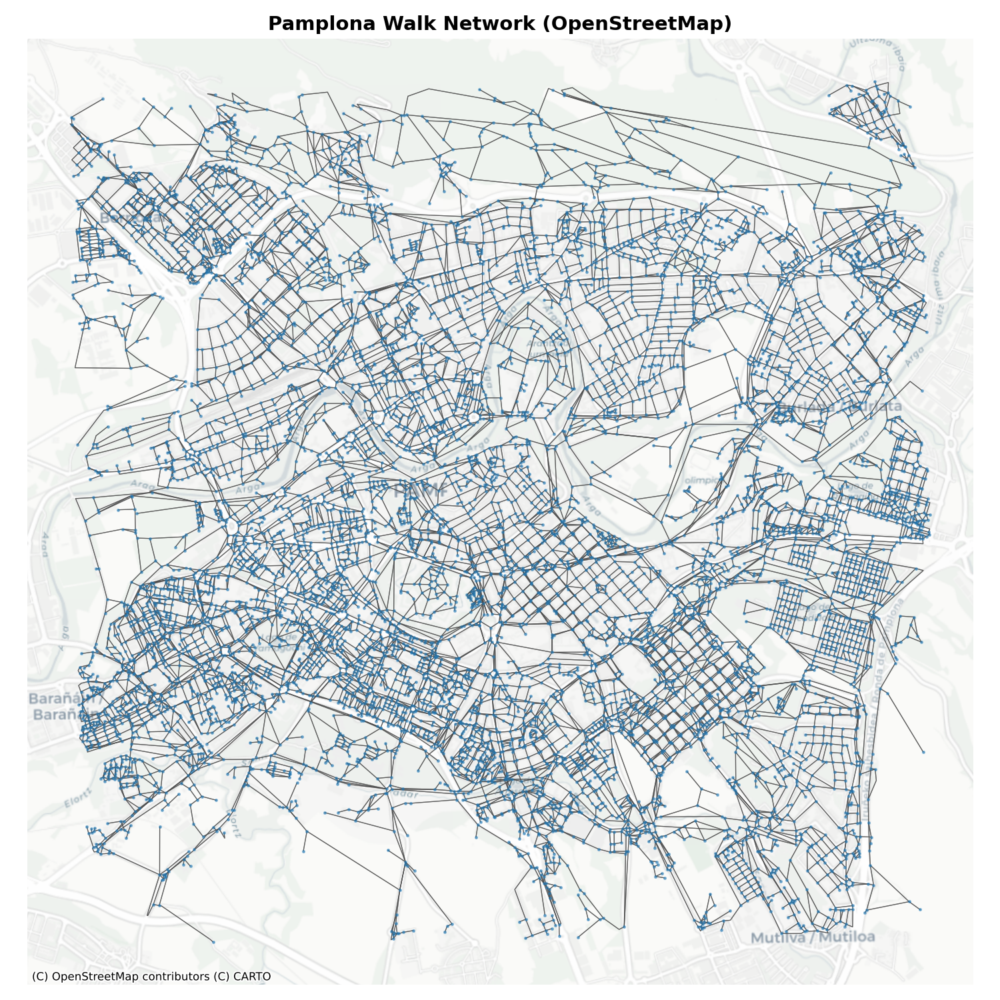
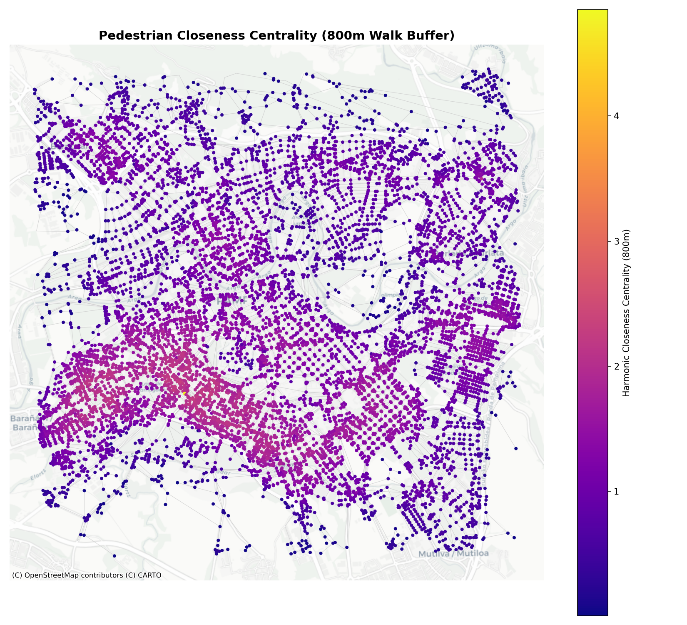
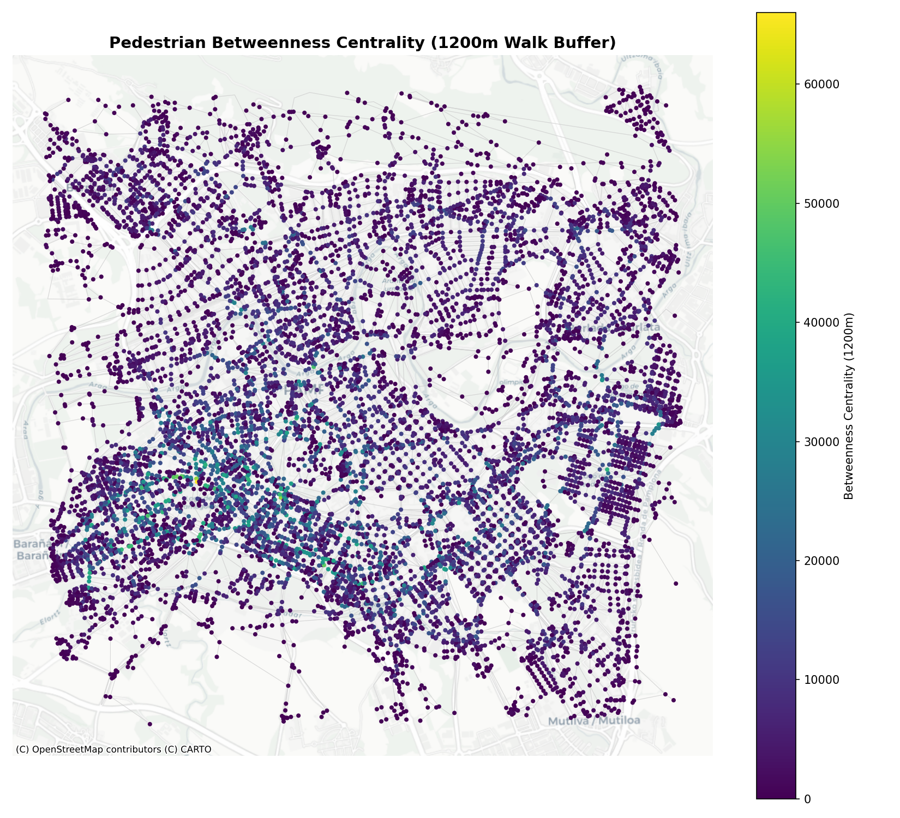
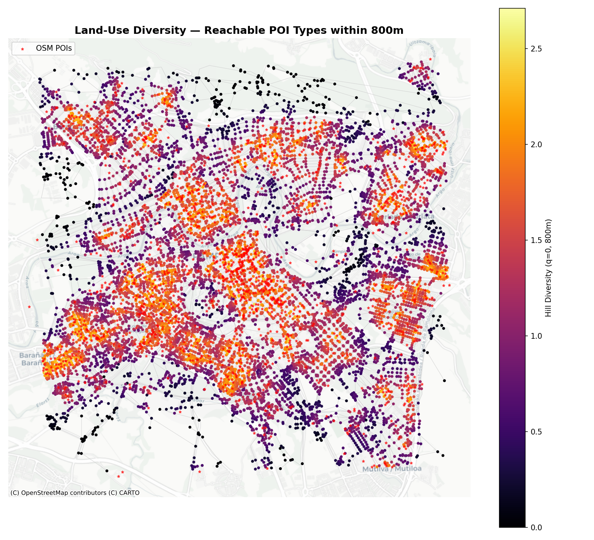

## Introduction

In traditional transport planning, network analysis has often focused on macro-scale vehicle flows. However, designing cities for active travel requires a pedestrian-scale understanding of network structures. Unlike automobiles, which typically follow long, uninterrupted routes across regional networks, pedestrian movements are highly localized and shaped by fine-grained street layouts and adjacent land uses.

This document demonstrates how to perform pedestrian-scale network analysis using the `cityseer` Python package alongside `osmnx` and OpenStreetMap (OSM) data. This approach serves as a powerful complement to the origin-destination and traffic flow analysis presented in the [Origin-Destination Python Workbook](od-data-python.qmd). While OD-routing models calculate path flows based on predefined trip demands, network centrality models analyze the topological layout itself, identifying "flow potential" and "reachability" which have been shown to correlate strongly with real-world pedestrian footfall.

### Why Pedestrian-Scale Analysis Matters

1. **Active Travel Infrastructure**: Planners can locate gaps in walking networks and prioritize improvements such as sidewalk widening, street trees, or traffic-calming measures where walking volumes are expected to be high.
2. **Pedestrian Safety**: High pedestrian-scale betweenness centrality highlights streets that act as natural pedestrian corridors. If these streets also carry heavy motor traffic, they represent priority sites for pedestrian crossings and traffic-calming.
3. **Retail and Vibrancy**: High closeness centrality corresponds to high local accessibility, which is a major driver of footfall, retail viability, and street-level vitality.

## Setup

First, we load the required Python libraries. To prevent OpenStreetMap downloads from writing to a read-only global cache directory, we configure `osmnx` to use a local writable cache directory in our virtual environment. We also configure `matplotlib` to run in headless mode.

```{python}
#| label: setup-env
import os
import matplotlib
matplotlib.use('Agg')  # Non-interactive backend for headless execution

import matplotlib.pyplot as plt
import osmnx as ox
import geopandas as gpd
import contextily as ctx
import pandas as pd
import numpy as np
import networkx as nx
from shapely.geometry import Point
from cityseer.tools import io, graphs
from cityseer.metrics import networks, layers

# Configure local writable cache for OSMnx
ox.settings.cache_folder = ".venv/osmnx_cache"
ox.settings.use_cache = True

# Ensure the images directory exists
os.makedirs("images", exist_ok=True)
```

## Choose Study Area and Download Network

We center our analysis on **Pamplona, Navarre, Spain** using the same geographical center as our origin-destination analysis. We download the walking (pedestrian) network from OpenStreetMap within a 3 km radius around the city center.

```{python}
#| label: download-network
# Coordinates of Pamplona city centre
latitude = 42.8166
longitude = -1.6432
radius_m = 3000

print(f"Downloading pedestrian network for Pamplona within a {radius_m}m radius...")
G_osm = ox.graph_from_point((latitude, longitude), dist=radius_m, network_type="walk")
print(f"Downloaded network: {len(G_osm.nodes):,} nodes and {len(G_osm.edges):,} edges.")
```

## Network Cleaning and Topology Simplification

Raw OpenStreetMap data is often topologically messy. It contains many degree-2 nodes (nodes that merely shape the geometry of a street rather than representing intersections) and dangling dead-ends. If computed directly, these redundant nodes inflate network metrics and slow down calculations.

`cityseer` addresses this by cleaning the street network:
1. We project the graph to a local coordinate system (UTM Zone 30N, `EPSG:32630`) so that distances are measured accurately in meters.
2. We relabel the nodes as strings to ensure compatibility with `cityseer` internal routing.
3. We remove degree-2 filler nodes and merge duplicate parallel edges.
4. We consolidate nodes that are within a small distance buffer (15 meters) to represent real-world intersections.

```{python}
#| label: clean-network
print("Projecting network to local UTM Zone 30N (EPSG:32630)...")
G_osm_proj = ox.project_graph(G_osm, to_crs="EPSG:32630")

# Workaround for cityseer node string-key requirements
print("Relabeling node keys to strings...")
G_osm_proj = nx.relabel_nodes(G_osm_proj, str)

print("Converting to cityseer MultiGraph...")
G_cityseer = io.nx_from_osm_nx(G_osm_proj)

print("Cleaning topology, removing filler nodes, and consolidating intersections...")
G_clean = graphs.nx_simple_geoms(G_cityseer)
G_clean = graphs.nx_remove_filler_nodes(G_clean)
G_clean = graphs.nx_consolidate_nodes(G_clean, buffer_dist=15)

print("Transposing MultiGraph into cityseer NetworkStructure...")
nodes_gdf, edges_gdf, network_structure = io.network_structure_from_nx(G_clean)
print(f"Cleaned network has {len(nodes_gdf):,} nodes and {len(edges_gdf):,} edges.")
```

Let's visualize the cleaned walking network overlaid on a CartoDB Positron basemap.

```{python}
#| label: plot-walking-network
#| results: hide
fig, ax = plt.subplots(figsize=(10, 10))
edges_gdf.plot(ax=ax, color="#4a4a4a", linewidth=0.6, alpha=0.7, zorder=1)
nodes_gdf.plot(ax=ax, color="#1f77b4", markersize=2, alpha=0.5, zorder=2)

# Add basemap using contextily
ctx.add_basemap(ax, crs=nodes_gdf.crs.to_string(), source=ctx.providers.CartoDB.Positron)
ax.set_title("Pamplona Walk Network (OpenStreetMap)", fontsize=14, fontweight="bold")
ax.set_axis_off()
plt.tight_layout()

# Save the figure
fig.savefig("images/walking-network-pamplona.png", dpi=150)
plt.close(fig)
print("Saved walking network plot.")
```

Here is the resulting pedestrian network for Pamplona:



## Pedestrian-Scale Centrality Measures

Centrality measures are computed using a localized "moving-window" approach. Unlike global centralities (which evaluate paths across the entire city), pedestrian centralities use local distance thresholds ($d_{max}$) representing typical walking distances:
- **400m**: ~5 minutes walk (micro-local access)
- **800m**: ~10 minutes walk (neighborhood access)
- **1200m**: ~15 minutes walk (community/active travel corridor scale)

We compute two primary forms of centrality:
1. **Harmonic Closeness Centrality**: Measures how close a node is to all other reachable nodes within a threshold. Nodes with high closeness represent highly accessible hubs.
2. **Betweenness Centrality**: Measures how often a node lies on the shortest paths between all pairs of nodes within the distance threshold. This identifies key pedestrian corridors.

```{python}
#| label: compute-centrality
print("Computing closeness and betweenness centralities at 400m, 800m, and 1200m...")
distances = [400, 800, 1200]
nodes_gdf = networks.node_centrality_shortest(
    network_structure,
    nodes_gdf,
    distances=distances,
    compute_closeness=True,
    compute_betweenness=True
)
print("Centrality calculations completed.")
```

### Closeness Centrality (800m)

Closeness centrality at 800m indicates the accessibility of a neighborhood center. Areas with high closeness are highly integrated into the street fabric, allowing pedestrians to easily reach many surrounding streets within a 10-minute walk.

```{python}
#| label: plot-closeness
#| results: hide
fig, ax = plt.subplots(figsize=(11, 10))
edges_gdf.plot(ax=ax, color="#cccccc", linewidth=0.5, alpha=0.5, zorder=1)

# Plot nodes colored by closeness
sc = nodes_gdf.plot(
    ax=ax,
    column="cc_harmonic_800",
    cmap="plasma",
    markersize=8,
    legend=True,
    legend_kwds={"label": "Harmonic Closeness Centrality (800m)"},
    zorder=2
)

ctx.add_basemap(ax, crs=nodes_gdf.crs.to_string(), source=ctx.providers.CartoDB.Positron)
ax.set_title("Pedestrian Closeness Centrality (800m Walk Buffer)", fontsize=14, fontweight="bold")
ax.set_axis_off()
plt.tight_layout()

fig.savefig("images/harmonic-closeness-800m.png", dpi=150)
plt.close(fig)
print("Saved closeness centrality plot.")
```

The closeness map highlights Pamplona's compact urban core and historic neighborhoods as the most accessible zones:



### Betweenness Centrality (1200m)

Betweenness centrality at 1200m models the "flow potential" of streets. High values identify streets and paths that act as corridors for walking trips up to 15 minutes long, serving as strong predictors of pedestrian footfall.

```{python}
#| label: plot-betweenness
#| results: hide
fig, ax = plt.subplots(figsize=(11, 10))
edges_gdf.plot(ax=ax, color="#cccccc", linewidth=0.5, alpha=0.5, zorder=1)

# Plot nodes colored by betweenness
sc = nodes_gdf.plot(
    ax=ax,
    column="cc_betweenness_1200",
    cmap="viridis",
    markersize=8,
    legend=True,
    legend_kwds={"label": "Betweenness Centrality (1200m)"},
    zorder=2
)

ctx.add_basemap(ax, crs=nodes_gdf.crs.to_string(), source=ctx.providers.CartoDB.Positron)
ax.set_title("Pedestrian Betweenness Centrality (1200m Walk Buffer)", fontsize=14, fontweight="bold")
ax.set_axis_off()
plt.tight_layout()

fig.savefig("images/betweenness-centrality.png", dpi=150)
plt.close(fig)
print("Saved betweenness centrality plot.")
```

The betweenness map identifies key arterial footpaths, bridges across the Arga river, and pedestrianized thoroughfares:



## Landuse Accessibility and Mixing

Walking volumes are not driven solely by the shape of the street network; they are also heavily influenced by the destination land uses adjacent to it. Using OpenStreetMap data, we can download points of interest (POIs) such as cafes, restaurants, parks, and supermarkets.

We then use `cityseer.metrics.layers` to compute:
- **Hill Diversity (Mixed-Use Index)**: Measures the diversity of reachable POI categories within a walk buffer. A high diversity index indicates a vibrant, mixed-use environment where daily needs can be met on foot.

```{python}
#| label: compute-landuse
print("Downloading POIs from OpenStreetMap features...")
tags = {
    "amenity": ["cafe", "restaurant", "fast_food", "school", "pharmacy", "bank"],
    "shop": ["supermarket", "convenience", "clothes", "bakery"],
    "leisure": ["park", "playground", "sports_centre"]
}
poi_gdf = ox.features_from_point((latitude, longitude), tags=tags, dist=radius_m)
print(f"Downloaded {len(poi_gdf):,} POI features.")

# Process POIs to project and compute centroids
poi_points = poi_gdf.copy()
poi_points = poi_points.to_crs("EPSG:32630")
poi_points["geometry"] = poi_points.geometry.centroid

# Map features to categories
def map_category(row):
    if isinstance(row.get("amenity"), str):
        return "amenity"
    elif isinstance(row.get("shop"), str):
        return "shop"
    elif isinstance(row.get("leisure"), str):
        return "leisure"
    return "other"

poi_points["category"] = poi_points.apply(map_category, axis=1)
poi_points = poi_points[poi_points["category"] != "other"].dropna(subset=["geometry"])
print(f"Filtered to {len(poi_points):,} valid POIs with categories (amenity, shop, leisure).")

print("Computing mixed-use diversity (Hill Diversity q=0) at 800m...")
nodes_gdf, poi_points_processed = layers.compute_mixed_uses(
    data_gdf=poi_points[["category", "geometry"]],
    landuse_column_label="category",
    nodes_gdf=nodes_gdf,
    network_structure=network_structure,
    distances=[800],
)
print("Mixed-use diversity calculations completed.")
```

### Visualizing Landuse Diversity

We plot the Hill Diversity index ($q=0$) at 800m. This represents the number of different POI categories (out of amenity, shop, and leisure) reachable within a 10-minute walk.

```{python}
#| label: plot-landuse-diversity
#| results: hide
fig, ax = plt.subplots(figsize=(11, 10))
edges_gdf.plot(ax=ax, color="#cccccc", linewidth=0.5, alpha=0.5, zorder=1)

# Plot diversity nodes
sc = nodes_gdf.plot(
    ax=ax,
    column="cc_hill_q0_800_wt",
    cmap="inferno",
    markersize=8,
    legend=True,
    legend_kwds={"label": "Hill Diversity (q=0, 800m)"},
    zorder=2
)

# Overlay POI points as red stars
poi_points.plot(ax=ax, color="red", marker="*", markersize=10, alpha=0.6, label="OSM POIs", zorder=3)

ctx.add_basemap(ax, crs=nodes_gdf.crs.to_string(), source=ctx.providers.CartoDB.Positron)
ax.set_title("Land-Use Diversity — Reachable POI Types within 800m", fontsize=14, fontweight="bold")
ax.legend(loc="upper left")
ax.set_axis_off()
plt.tight_layout()

fig.savefig("images/landuse-accessibility.png", dpi=150)
plt.close(fig)
print("Saved land-use diversity plot.")
```

The resulting diversity map shows which neighborhoods enjoy a complete mix of shops, amenities, and leisure within short walking distance, making them highly walkable "15-minute neighborhood" hubs:



## Informing Active Travel Planning

The combination of network centrality and land-use diversity provides a powerful, empirical framework for active travel planning:

1. **Prioritizing Corridor Upgrades**: Streets with high betweenness centrality (high flow potential) should be prioritized for pedestrian infrastructure investments, such as widening sidewalks, constructing pedestrian crossings, and implementing speed limits.
2. **Identifying Walkability Gaps**: Areas with low closeness centrality and low land-use diversity indicate neighborhoods where residents are car-dependent. Planners can target these gaps by encouraging local commercial zoning or establishing community services in accessibility deserts.
3. **Validating OD Demand Flow Models**: By comparing these topological indicators with the demand flows calculated in [Origin-Destination Python Workbook](od-data-python.qmd), planners can cross-verify which corridors are critical from both a local accessibility standpoint and a regional routing perspective.
