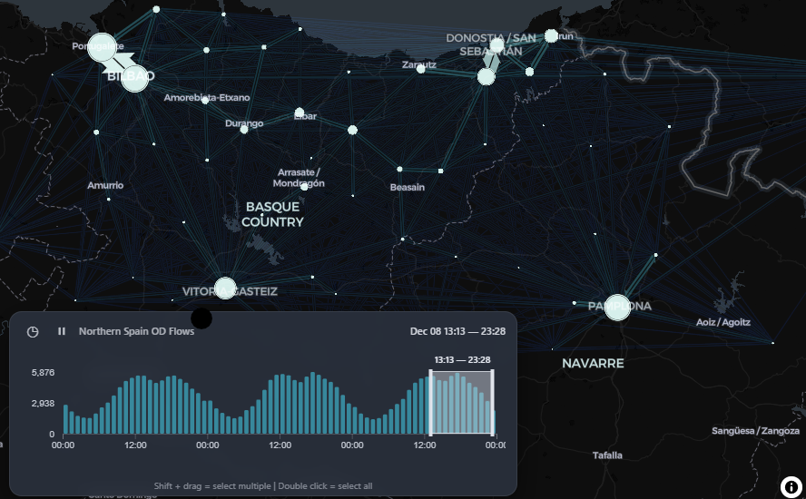

## Install the required packages

```{r}
#| eval: false
library(spanishoddata)
library(flowmapblue)
library(mapgl)
library(tidyverse)
library(sf)
library(tmap)
tmap_mode("view")
```

## Download and prepare the data

The example builds on the code in the [Prerequisites](prerequisites.qmd) section (see [demo.qmd](demo.qmd) for a minimal example).

### Northern Spain case study: Pamplona to Donostia corridor

As an alternative to Seville, you can explore mobility patterns in Northern Spain, covering the Basque Country and Navarre regions.
This area includes the cities of Pamplona (Iruña) and Donostia (San Sebastián), stretches from the French border to the Bay of Biscay coast, and forms a roughly rectangular study area whose east--west extent is longer than its north--south extent.

Rather than filtering by a text pattern (as with Seville), we define the study area geographically with a bounding box and select all districts that intersect it.
The province codes in the zone `id` field can also be used: Navarre = `31`, Gipuzkoa = `20`, Bizkaia = `48`, and Álava = `01`.

```{r}
#| label: flowmap-northern-spain
#| eval: false
#| echo: true
#| code-summary: "Reproducible example of an interactive flow map for Northern Spain"
spod_set_data_dir('data')
# Get zones
zones <- spod_get_zones(zones = "distr", ver = 2)
valid_dates <- spod_get_valid_dates(2)
recent_dates = tail(valid_dates, 3)

# Define a geographic bounding box for the Northern Spain study area
# Covers from the coast to south of Pamplona, and from the French border
# westward to include the Pamplona--Donostia corridor
bbox_north <- st_bbox(
  c(xmin = -3.1, ymin = 42.8, xmax = -1.0, ymax = 43.4),
  crs = st_crs(4326)
)
bbox_sf <- st_as_sfc(bbox_north)

# Select zones that intersect the bounding box
sf::sf_use_s2(FALSE)
zones_wgs84 <- st_transform(zones, 4326)
zones_north <- zones_wgs84 |>
  st_filter(bbox_sf, .predicate = st_intersects)

# Visualise the selected zones
plot(st_geometry(zones_north))
mapview::mapview(zones_north) + mapview::mapview(st_geometry(bbox_sf), color = "red", alpha.regions = 0, lwd = 2)

# Prepare location data (centroids) for the flow map
locations_north <- zones_north |>
  st_centroid() |>
  st_coordinates() |>
  as.data.frame() |>
  mutate(id = zones_north$id) |>
  rename(lon = X, lat = Y)

```

To get the data for the flow map, we download the OD flows for the recent dates and filter to the zones in our study area.
We then aggregate the flows by hour to create a spatio-temporal dataset suitable for animation, using the following code block.
For workshop use, we have precomputed this dataset and saved it as an RDS file, so you can skip the download step if you prefer.

<details>

<summary>Data download and preparation code (uncomment to run)</summary>

```{r}
#| eval: false
system.time({
flows <- spod_get(
  type = "origin-destination",
  zones = "districts",
  dates = recent_dates
)

od_data_time <- flows |>
  mutate(time = as.POSIXct(paste0(date, "T", hour, ":00:00"))) |>
  group_by(origin = id_origin, dest = id_destination, time) |>
  summarise(count = sum(n_trips, na.rm = TRUE), .groups = "drop") |>
  collect()

flows_north_time <- od_data_time |>
  filter(origin %in% zones_north$id & dest %in% zones_north$id)
})
# Save as arrow:
arrow::write_parquet(flows_north_time, "flows_north_time.parquet")
arrow::write_parquet(locations_north, "locations_north.parquet")
```

```{r}
#| eval: false
#| echo: false
# check dataset sizes in memory:
object.size(flows) |> print(units = "Mb")
object.size(od_data_time) |> print(units = "Mb")
object.size(flows_north_time) |> print(units = "Mb")
# We'll also save the datasets as .rds files for people who don't have arrow:
saveRDS(flows_north_time, "flows_north_time.rds")
saveRDS(locations_north, "locations_north.rds")
system("gh release list")
system("gh release upload v1 flows_north_time.parquet locations_north.parquet flows_north_time.rds locations_north.rds --clobber")
```

</details>

```{r}
if (!file.exists("flows_north_time.rds")) {
  message("Precomputed Northern Spain data not found. Download the raw data with the code block above or download from the GitHub release assets.")
  # Download from GitHub release assets:
  # system("gh release download v1 --pattern 'flows_north_time.rds'")
  release_url <- "https://github.com/tdscience/tartu26/releases/download/v1/"
  for(f in c("flows_north_time.rds", "locations_north.rds")) {
    download.file(paste0(release_url, f), f, mode = "wb")
  }
}
```

## Generate the interactive flow map

### Northern Spain flow map

```{r}
#| label: flowmap-northern-spain-render
#| eval: false
#| echo: true
#| code-summary: "Render the interactive flow map for Northern Spain"

flowmap_north_interactive <- flowmapblue(
  locations = locations_north,
  flows = flows_north_time,
  mapboxAccessToken = Sys.getenv("MAPBOX_TOKEN"),
  darkMode = TRUE,
  animation = FALSE,
  clustering = TRUE
)

# Display the map
flowmap_north_interactive
```


### Northern Spain flow map using `mapgl`

Alternatively, we can use the `mapgl` package to visualize the Northern Spain flows using high-performance WebGL rendering.
This operates entirely within the browser without requiring a Mapbox account, and adds an interactive timeline scrubber to explore the spatio-temporal trends.

```{r}
#| label: flowmap-northern-spain-mapgl
#| eval: false
#| echo: true
#| code-summary: "Render the Northern Spain flow map using mapgl and MapLibre"

library(mapgl)

# Create the MapLibre map centered on the Northern Spain corridor
north_mapgl <- maplibre(
  style = carto_style("dark-matter"),
  center = c(-1.75, 43.05),
  zoom = 8.5,
  projection = "mercator"
) |>
  add_flowmap(
    id = "north-flows",
    locations = locations_north,
    flows = flows_north_time,
    flow_time_column = "time",
    flow_color_scheme = "Teal",
    flow_dark_mode = TRUE
  ) |>
  add_time_control(
    data = flows_north_time,
    time_column = "time",
    time_interval = "hour",
    title = "Northern Spain OD Flows"
  )

# Display the map
north_mapgl
```

You should see something like this:



```{r}
#| eval: false
#| echo: false

# Save the map as an HTML file
htmlwidgets::saveWidget(flowmap_north_interactive, "north_spain_flowmap.html")
```

<details>

<summary>Getting a Mapbox token</summary>

## Setting up Mapbox Access Token

Get a free token from https://account.mapbox.com/access-tokens/

Or, longer term solution: `usethis::edit_r_environ()` Restart R after setting the token for it to take effect

``` r
Sys.setenv(MAPBOX_TOKEN="YOUR_MAPBOX_ACCESS_TOKEN")
```

</details>

## Cross-border analysis: Spain--France border effect

One of the most interesting research questions we can tackle with the Northern Spain study area is: **to what extent does the national border between Spain and France act as a barrier to human mobility?** The v2 spanishoddata data includes French zones (with IDs starting `FR`) alongside Spanish zones, making it possible to quantify the "border deterrence effect" -- the reduction in travel attributable to the presence of an international boundary, after controlling for distance.

### Approach

Our analysis proceeds in five steps:

1.  **Identify French and Spanish zones** in the study area using the zone ID prefix (`FR` = France, all-numeric = Spain).
2.  **Classify each OD pair** as cross-border (ES--FR), within-Spain (ES--ES), or within-France (FR--FR).
3.  **Aggregate trip volumes** by hour and border-crossing status to reveal temporal patterns.
4.  **Estimate the border effect** by comparing trip counts at comparable distances: for each distance band, what is the ratio of within-Spain trips to cross-border trips?
5.  **Visualise** the results as a distance-decay comparison plot.

```{r}
#| label: cross-border-analysis
#| eval: false
#| echo: true
#| code-summary: "Quantifying the Spain--France border effect on mobility"

# ── 1. Load zones and classify by country ──────────────────────────────
sf::sf_use_s2(FALSE)
zones <- spod_get_zones(zones = "distr", ver = 2)

# Recreate the Northern Spain study area
bbox_north <- st_bbox(
  c(xmin = -2.5, ymin = 42.6, xmax = -1.0, ymax = 43.5),
  crs = st_crs(4326)
)
bbox_sf <- st_as_sfc(bbox_north)
zones_wgs84 <- st_transform(zones, 4326)
zones_north <- zones_wgs84[
  st_intersects(zones_wgs84, bbox_sf, sparse = FALSE)[, 1],
]

# Tag each zone by country
zones_north <- zones_north |>
  mutate(country = ifelse(grepl("^FR", id), "FR", "ES"))

cat("Zones in study area:", nrow(zones_north), "\n")
cat("  Spanish:", sum(zones_north$country == "ES"), "\n")
cat("  French: ", sum(zones_north$country == "FR"), "\n")

# ── 2. Get OD data and classify each pair ───────────────────────────
valid_dates <- spod_get_valid_dates(2)
recent_dates <- tail(valid_dates, 3)

flows <- spod_get(
  type = "origin-destination",
  zones = "districts",
  dates = recent_dates
)

# Build a lookup table: zone ID → country
zone_country <- zones_north |>
  st_drop_geometry() |>
  select(id, country)

# Filter to study-area zones and tag each OD pair
od_north <- flows |>
  filter(
    id_origin %in% zones_north$id,
    id_destination %in% zones_north$id
  ) |>
  left_join(zone_country, by = c("id_origin" = "id")) |>
  rename(country_origin = country) |>
  left_join(zone_country, by = c("id_destination" = "id")) |>
  rename(country_dest = country) |>
  mutate(
    border_crossing = case_when(
      country_origin != country_dest ~ "cross-border",
      country_origin == "ES"         ~ "within-Spain",
      country_origin == "FR"         ~ "within-France"
    )
  )

# ── 3. Temporal patterns by border status ──────────────────────────
hourly_by_border <- od_north |>
  group_by(hour, border_crossing) |>
  summarise(
    total_trips = sum(n_trips, na.rm = TRUE),
    .groups = "drop"
  ) |>
  collect()

# Plot: trip volumes by hour, faceted by border status
ggplot(hourly_by_border, aes(x = hour, y = total_trips, colour = border_crossing)) +
  geom_line(linewidth = 1) +
  scale_y_log10(labels = scales::comma) +
  labs(
    title = "Hourly trip volumes by border-crossing status",
    subtitle = paste("Northern Spain study area,", 
                     paste(recent_dates, collapse = ", ")),
    x = "Hour of day",
    y = "Total trips (log scale)",
    colour = "Flow type"
  ) +
  theme_minimal()

# ── 4. Distance-decay comparison ───────────────────────────────────
# Compare within-Spain vs cross-border flows at similar distances
dist_comparison <- od_north |>
  filter(distance > 0, distance < 100) |>    # exclude intra-zonal (d=0) and extreme
  mutate(dist_band = cut(distance, breaks = seq(0, 100, by = 10))) |>
  group_by(dist_band, border_crossing) |>
  summarise(
    total_trips = sum(n_trips, na.rm = TRUE),
    n_pairs     = n(),
    .groups     = "drop"
  ) |>
  collect()

# Calculate the border deterrence ratio
border_ratio <- dist_comparison |>
  filter(border_crossing %in% c("within-Spain", "cross-border")) |>
  tidyr::pivot_wider(
    id_cols     = dist_band,
    names_from  = border_crossing,
    values_from = total_trips,
    values_fill = 0
  ) |>
  mutate(
    deterrence_ratio = `within-Spain` / (`cross-border` + 1),  # +1 avoids Inf
    deterrence_label = paste0(round(deterrence_ratio, 1), "×")
  )

ggplot(border_ratio, aes(x = dist_band, y = deterrence_ratio)) +
  geom_col(fill = "steelblue", alpha = 0.7) +
  geom_text(aes(label = deterrence_label), vjust = -0.3, size = 3) +
  labs(
    title = "Border deterrence effect by distance band",
    subtitle = "Ratio of within-Spain to cross-border trips (>1 = border deters travel)",
    x = "Distance band (km)",
    y = "Within-Spain / Cross-border trip ratio"
  ) +
  theme_minimal()

# ── 5. Summary statistics ──────────────────────────────────────────
cat("\n=== Summary: Border effect ===\n")
total_cross <- sum(hourly_by_border$total_trips[
  hourly_by_border$border_crossing == "cross-border"
])
total_spain <- sum(hourly_by_border$total_trips[
  hourly_by_border$border_crossing == "within-Spain"
])
cat(sprintf("Cross-border trips: %s (%.1f%% of all trips)\n",
  scales::comma(total_cross),
  100 * total_cross / (total_cross + total_spain)
))
```

### Interpretation

-   **Temporal pattern**: Cross-border flows typically show a flatter daily profile than within-Spain commuting flows, suggesting more leisure/tourism travel and less routine commuting across the border.
-   **Distance-decay**: The `deterrence_ratio` column shows how many more within-Spain trips occur than cross-border trips at the same distance. A ratio of, say, 10× at the 10--20 km band means there are 10 times more trips between Spanish zones 15 km apart than between a Spanish and French zone 15 km apart.
-   **Key question**: At what distance does the border effect become negligible? If the ratio approaches 1 at longer distances, the border may primarily suppress short-distance local trips.

### Further exploration

-   Repeat the analysis for **weekdays vs weekends** to see if cross-border commuting is more common on certain days.
-   Use the `activity_origin` field to see whether cross-border trips are predominantly work, leisure, or study-related.
-   Expand the study area westward to include **Bilbao** and compare the border effect at Irun/Hendaye (major crossing) versus more remote Pyrenean crossings.
-   Download a **full month** of data and examine how the border effect changes on public holidays and during school vacations.

## Research questions

Below are suggested research questions you can explore with the `spanishoddata` package and the tools introduced in this workbook.
They range from descriptive to analytical and are designed to be tractable within a short workshop or assignment.

1.  **Temporal commuting patterns** -- How do morning and evening peak flows differ between weekdays and weekends?
    Can you identify distinct commuter corridors within your chosen study area?

2.  **Cross-border mobility** -- The v2 data includes trips to and from France.
    What proportion of flows in the Northern Spain study area cross the international border, and how does this vary by time of day?
    *(See the cross-border analysis section above for a worked example.)*

3.  **Socio-demographic differences** -- Using the `income`, `age`, and `sex` variables available in v2, do flow patterns differ between demographic groups?
    For example, do higher-income groups travel further or at different times?

4.  **Functional urban area definition** -- Compare the 10 km buffer approach used for Seville with the bounding-box approach used for Northern Spain.
    How sensitive are the resulting flow patterns to the choice of study area boundary?

5.  **Activity-purpose flows** -- The `activity_origin` and `activity_destination` fields classify trips by purpose (home, work, regular, irregular, study).
    What is the dominant flow purpose in your study area, and how does the spatial structure of work-related flows differ from leisure-related flows?

6.  **Intra-zonal vs inter-zonal trips** -- Intra-zonal trips (where origin equals destination) often dominate OD datasets.
    What share of trips are intra-zonal in your study area, and how does excluding them change the visual pattern of the flow map?

7.  **Seasonal or special-event variation** -- If you download data for multiple time periods, can you detect changes in mobility associated with public holidays, festivals (e.g., San Fermín in Pamplona), or seasonal tourism patterns along the coast?

8.  **Comparative urban analysis** -- Replicate the analysis for both Seville and Northern Spain.
    Which city has higher average trip distances?
    Which shows more polycentric flow patterns (multiple distinct centres rather than a single dominant hub)?

## Further resources

This workbook builds on the tutorial "Analysing massive open human mobility data in R using spanishoddata, duckdb and flowmaps" [@kotovAGIT2025Workshop2025], and the spatio-temporal data [session](https://tdscience.github.io/dstp/s4.html) in the [Data Science for Transport Planning course](https://tdscience.github.io/dstp/).
For a detailed description of the dataset and its potential applications, see the original paper introducing the `spanishoddata` package [@kotov2026].

For a detailed walkthrough of analysing origin-destination data in the London Cycle Hire system, see the [DSTP course materials](https://tdscience.github.io/dstp/s3.html#analyisng-origin-destination-data-in-london-cycle-hire-system).

Also see @kotovAGIT2025Workshop2025 which includes:

-   [Setting up the software](https://www.ekotov.pro/agit-2025-spanishoddata/software-setup.html)
-   [Importing the data](https://www.ekotov.pro/agit-2025-spanishoddata/1-mobility-data.html)
-   [Visualising the data with flowmaps](https://www.ekotov.pro/agit-2025-spanishoddata/2-flowmapping.html)

## References